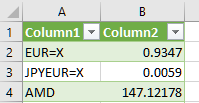

# Intro

This repro just does very basic yahoo API requests to generate a CSV with the requested stocks in EUR. This can easily be tweaked to output in USD if desired, but not included for simplicity.

## Usage

Install C# ASP.NET, and then build the executable. After building, run it as follows:

`dotnet StockFetcher.exe`

Once it's running, you can query a CSV file by using the following URL:

http://localhost:5000/StockFetcher?inputTickers=EUR%3dX,JPYEUR%3dX,AMD

The example above converts all stocks to EUR and generates a CSV separated by a semicolon and decimals using comma. If the stock is in a 'foreign' currency such as USD or JPY, it needs the conversion rate. EUR=x and JPYEUR=X are used for this. Keep in mind that this is a URL, so special characters like = are escaped as %3d. 

The output in this case is:

```
EUR=X;0,9347
JPYEUR=X;0,0059
AMD;147,12178
```

And can easily be used in Excel to maintain stock values. Make sure to pin this executable to restart if it's important to keep it running 24/7.

